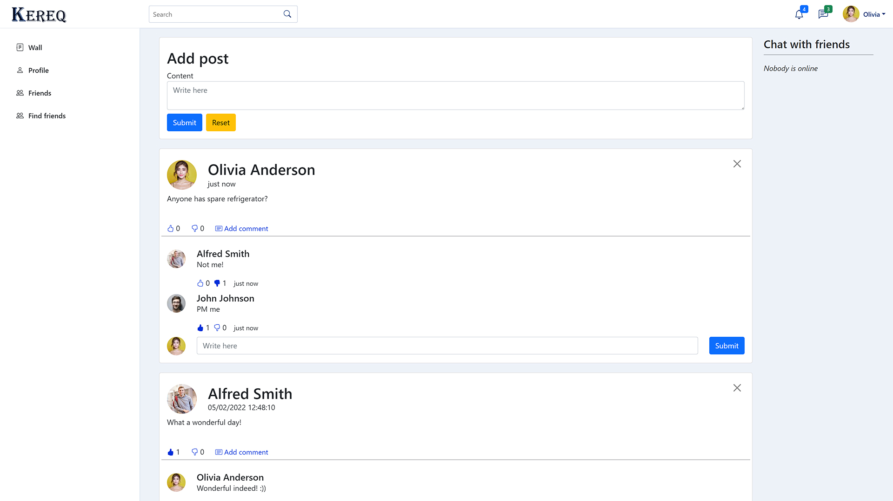
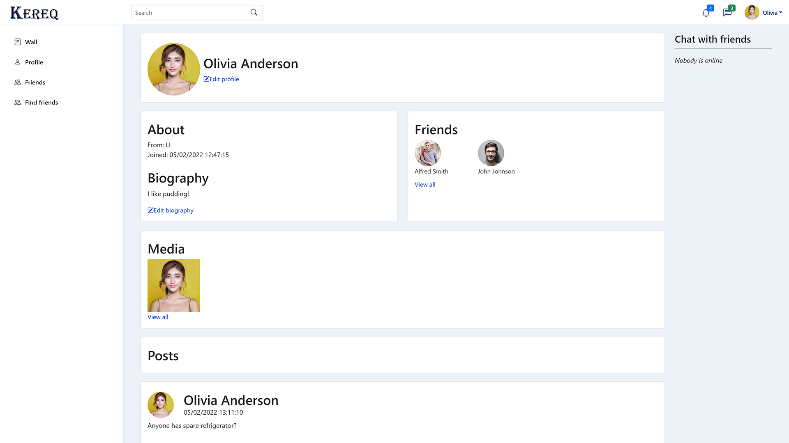

# Kereq (Backend)
Backend part of social media platform named Kereq.

## Table of Contents
* [General Info](#general-information)
* [Tech Stack](#tech-stack)
* [Features](#features)
* [Screenshots](#screenshots)
* [Project Status](#project-status)

## General Information
Kereq is social media platform, where users can share information about them and create virtual communities.
This project's purpose is fully educational. Reasons why I chose this type of project:
- It is challenging
- It has a lot of potential feature/technologies to use (fe. WebSockets, Messaging, efficient File Storage System)
- Cyclic tasks for various types of operations will be needed
- It is fun

## Tech Stack
- Java 11
- Spring Boot 2.5.5
- PostgreSQL
- RabbitMQ
- Ehcache
- AspectJ

## Screenshots

## Project Status
In progress: early alpha.
